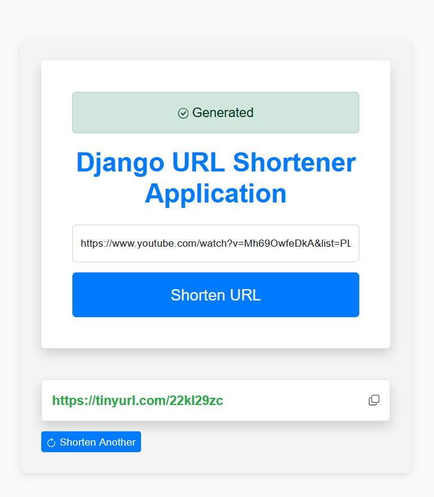

Here's a sample README file content for your URL Shortener project, including instructions for adding a screenshot:

````markdown
# URL Shortener

A simple URL shortener application built with Django. This project allows users to enter long URLs and receive a shortened version for easier sharing.

## Features

- Shorten long URLs using the TinyURL API.
- Copy shortened URLs to clipboard with a click.
- Responsive design using Bootstrap.

## Screenshot



## Installation

1. Clone the repository:

   ```bash
   git clone https://github.com/Y00RG/URL-Shortener.git
   ```
````

2. Navigate to the project directory:

   ```bash
   cd URL-Shortener
   ```

3. Set up a virtual environment:

   ```bash
   python -m venv venv
   ```

4. Activate the virtual environment:

   - On Windows:

     ```bash
     venv\Scripts\activate
     ```

   - On macOS/Linux:

     ```bash
     source venv/bin/activate
     ```

5. Install the required packages:

   ```bash
   pip install -r requirements.txt
   ```

6. Run database migrations:

   ```bash
   python manage.py migrate
   ```

7. Start the development server:

   ```bash
   python manage.py runserver
   ```

8. Open your browser and navigate to `http://127.0.0.1:8000/`.

## Usage

- Enter a long URL in the input field and click "Shorten URL" to generate a shortened link.
- You can copy the shortened URL using the copy icon.
